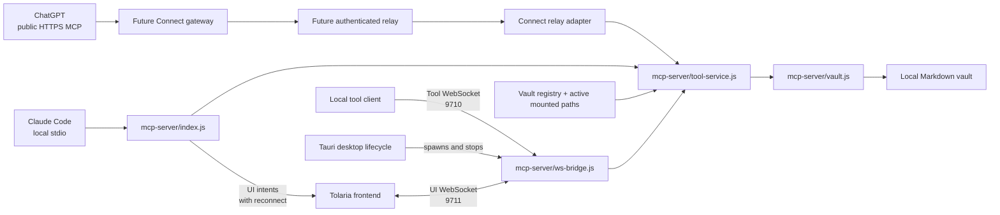

# Tolaria Connect: Current Architecture Map

## Scope

This map records the Stage 0 inspection required by
`docs/TOLARIA-CONNECT-PROJECT.md`. It describes the current desktop-side MCP
boundaries and selects the smallest insertion point for the Stage 1 fake-relay
vertical slice.

## Current execution paths

### Semantic boundary

`mcp-server/tool-service.js` is the shared semantic boundary. It resolves the
active mounted vault set at call time, rejects ambiguous or inactive vault
paths, delegates filesystem operations to `vault.js`, and emits transport-
neutral UI intents for mutations and note opening. The existing stdio and
WebSocket entry points both delegate to this service; neither owns Markdown
read/write behavior.

### Existing transports

- `mcp-server/index.js` exposes the MCP SDK stdio server and maps tool calls to
  the service. This is the direct-local integration foundation for Claude Code
  and other clients that support stdio. It also maintains an outbound loopback
  UI WebSocket client for UI intents.
- `mcp-server/ws-bridge.js` exposes the loopback tool WebSocket on port 9710
  and the loopback UI broadcast bridge on port 9711. Its tool protocol is an
  `{ id, tool, args }` request with `{ id, result }` or `{ id, error }` response.
- `src-tauri/src/mcp.rs` starts `ws-bridge.js` with the active mounted vault
  paths. `src-tauri/src/desktop_runtime.rs` owns startup, vault-change
  synchronization, and child cleanup.

### Authorization and vault scope

The current WebSocket bridge is loopback-only and rejects browser origins on
the tool port. The tool service further limits note paths to active mounted
vault roots and requires an explicit `vaultPath` when a relative path is
ambiguous. These controls are local-desktop safeguards, not a Connect session
protocol.

## Supported connection modes

Tolaria Connect has two client-facing paths:

1. **Direct local MCP, beginning with Claude Code.** Claude Code receives the
   existing vault-neutral stdio MCP registration and invokes
   `mcp-server/index.js` locally. Vault contents stay on the device, and no
   Connect gateway is required for this path.
2. **Relay-backed public MCP, beginning with ChatGPT.** ChatGPT reaches a
   future public HTTPS gateway. The gateway routes an authenticated session to
   the desktop's outbound relay, which delegates to the same tool service.

The two paths must share tool semantics and authorization intent, but they do
not need to share the same network transport. Direct stdio is not a fallback
for ChatGPT, and the public relay is not required for Claude Code.

## Stage 1 insertion point

Add a small relay adapter beside `ws-bridge.js` that accepts a relay envelope,
tracks an explicitly authenticated local session, and dispatches only the
Stage 1 tools (`read_note` and `create_note`) to an injected
`createMcpToolService()` instance. The adapter should return structured
authorization, disconnected-session, unknown-tool, and tool-error responses.

The fake relay test should connect a session, call `read_note`, call
`create_note`, read the created note back, then verify that an invalid
credential and a disconnected session cannot invoke either operation. This
proves the seam without opening a public port, adding gateway code, or
duplicating vault operations.

The direct Claude path is already represented by the stdio entry point and its
MCP lifecycle tests. Stage 1 must preserve that path while proving the relay
path independently.

## Boundaries intentionally deferred

- Public HTTPS gateway, OAuth/account infrastructure, and marketplace metadata.
- Persistent device identity, pairing, credential rotation, and revocation UX.
- Reconnect behavior for a real outbound relay transport.
- New settings UI or user-facing localization.
- Changes to existing stdio or loopback WebSocket behavior.

## Assumptions and open questions

- The Stage 1 relay envelope is a local test protocol and must not be treated
  as the final gateway protocol.
- The adapter will receive an already-created tool service so vault semantics
  remain centralized and injectable in tests.
- Read and write authorization will be represented separately in the adapter
  even though the first slice uses one session credential; the final protocol
  still needs a concrete capability model.
- The persistent outbound transport, credential format, and gateway routing
  remain unresolved until this local seam is proven.
